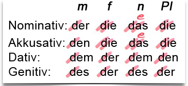

Kasusendungen sind prinzipiell identisch mit dem bestimmten Artike ohne “d”
---------------------------------------------------------------------------

Diese Kasusendungen können auch in anderen Begleitern stehen; wir nennen sie dann starke Endungen. Starke Endungen zeigen immer den Kasus an! Sie stehen immer auch im Demonstrativpronomen (dieser, dieses...), oft auch im unbestimmten Artikel (einem...) und manchmal auch im Possessivpronomen (meinem...). Sie können auch im Adjektiv stehen.

Source: <https://www.beste-tipps-zum-deutsch-lernen.com/adjektivdeklination/>
